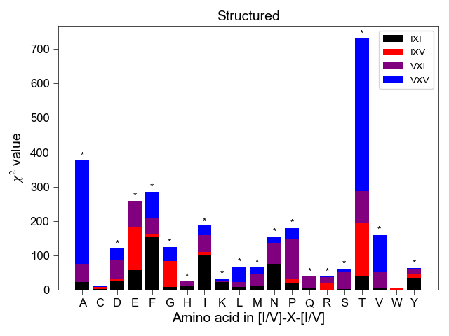
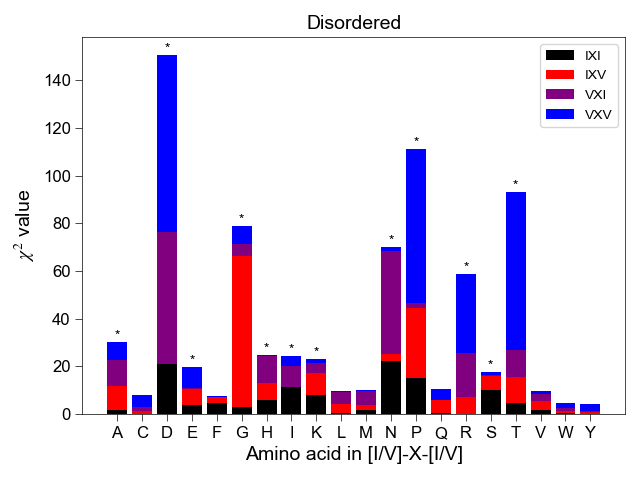
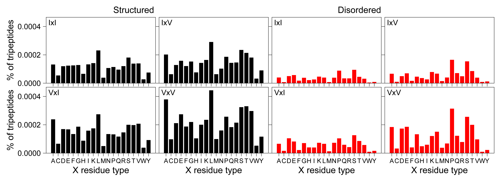
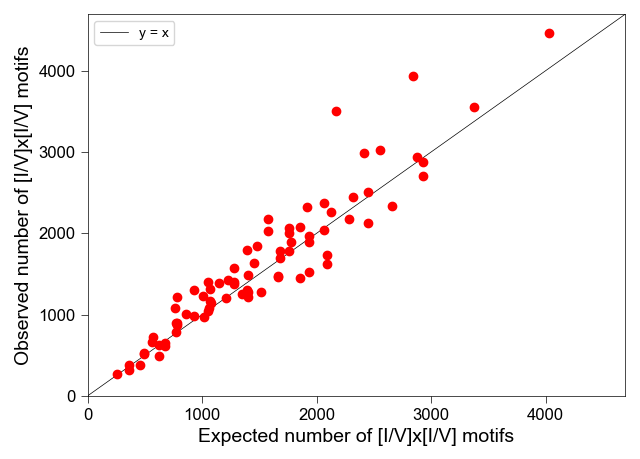

## Python code for the bioinformatics analyses from Alderson, Adriaenssens, et al.

### Searches a proteome for specific motifs and performs statistical tests.<br /> 

Given a supplied proteome and queried peptide motif(s), the script will search for the number of instances of the motif(s) and calculate the expected number of instances based on amino acid frequencies in the proteome. If a list of disordered regions is supplied, then a comparison between structured and disordered regions of the proteome can be perofrmed. Flexible input within the amino-acid motif is permitted; for example, "X" allows any residue at that position and multiple residues indicate "or". Residue positions are separated by the _ character, and so the IxI/V motif would be inputted as, "IV_X_IV". <br />

To execute this script, the user must have **biopython**, **itertools**, **numpy**, **pandas**, and **scipy** installed in their Python distribution. The user must provide a proteome file downloaded from [UniProt](https://www.uniprot.org/) or in FASTA format. For example outputs, see the images below: <br />
<br />
* Statistical tests to check for deviations from expectations based on amino-acid frequencies in the proteome
<p align="left">
  
  
</p>
<br />

* Comparison of IxI/V motif frequency in structured and disordered regions of the proteome <br />
<p align="left">
  
</p>

<br />
<br />

A UniProt proteome file can be loaded like this:


```python
p = Proteome()
human = p.load_uniprot('human_proteome.tab')

# Note that the UniProt file should contain the following columns
# 'Entry', 'Entry name', 'Status', 'Protein names', 'Gene names', 'Organism', 'Length', 'Sequence'
```
We can calculate the length and amino-acid composition of the proteome as such:

```python
length = p.proteome_length(human)                 # the number of amino acid in the proteome
composition = p.proteome_AA_fractions(human)      # the amino acid fractions in the proteome

print(length)
11373813

print(composition)
AA  Fraction
A  0.070190
C  0.022974
D  0.047391
E  0.071040
F  0.036479
G  0.065723
H  0.026239
I  0.043344
K  0.057259
L  0.099601
M  0.021318
N  0.035851
P  0.063116
Q  0.047705
R  0.056423
S  0.083255
T  0.053569
V  0.059672
W  0.012188
Y  0.026661
```

Counting the number of times a specific motif occurs can be performed like this:

```python
query = 'IPV'                               # the motif of interest
count_motif = p.find_motifs(human, query)   # motif count and fraction WRT same-sized motifs

print(count_motif)
(2076, 0.0001825)
```

and for flexible input:

```python
flex_query = 'IV_X_IV'                              # "_" separates residues, "X" is wild card, >1 AA means "or"
iterator = p.iterate_motif(flex_query)              # generates list of motifs consistent with flex input
count_motifs = p.find_flex_motifs(human, iterator)  # motif, count, and fraction WRT same-sized motifs

print(count_motifs)
    Motif  Count  Fraction
0    IAI   1322  0.000116
1    IAV   2035  0.000179
2    ICI    529  0.000047
3    ICV    617  0.000054
4    IDI   1228  0.000108
..   ...    ...       ...
75   VVV   2988  0.000263
76   VWI    379  0.000033
77   VWV    512  0.000045
78   VYI    900  0.000079
79   VYV   1137  0.000100
```

We can compare and plot the observed frequencies of particular motifs vs. those expected from amino acid composition alone:
```python
expected_motifs = p.expected_motifs(human, iterator)   # Pandas dataframe : motif, probability, observed, expected

print(expected_motifs)
   Motif  Probability  Observed  Expected
0    IAI     0.000132    1322.0    1499.0
1    IAV     0.000182    2035.0    2064.0
2    ICI     0.000043     529.0     490.0
3    ICV     0.000059     617.0     675.0
4    IDI     0.000089    1228.0    1012.0
..   ...          ...       ...       ...
75   VVV     0.000212    2988.0    2416.0
76   VWI     0.000032     379.0     358.0
77   VWV     0.000043     512.0     493.0
78   VYI     0.000069     900.0     784.0
79   VYV     0.000095    1137.0    1079.0

# Create the label for the axes on the plot
xlab = []
for i, res in enumerate(query.split("_")):
    if len(res)>1:
        xlab.append('['+'/'.join(list(res))+']')
    else:
        if res == 'X':
            xlab.append(res.lower())
        else:
            xlab.append(res)
xlab = ''.join(xlab)

# Now set up the plot
xy_max = max(1.05*np.max(expected['Expected'][1:]), 1.05*np.max(expected['Observed'][1:]))
plt.plot([0, xy_max], [0, xy_max], 'k-', lw=0.5, label='y = x')
plt.plot(expected['Expected'][1:], expected['Observed'][1:], 'ro')
plt.xlabel('Expected number of %s motifs' % xlab)
plt.ylabel('Observed number of %s motifs' % xlab)
plt.legend(loc='upper left')
plt.xlim(0, xy_max)
plt.ylim(0, xy_max)
plt.tight_layout()
plt.show()
```
<p align="left">
  
</p>

<br />
We can subtract out the contribution of a smaller region of a proteome from the entire proteome<br/>
and perform a chi-squared analysis:

```python
query = 'IV_X_IV'
IDRs = p.load_fasta("human_idrs.fasta")   # Load a FASTA file with disordered regions
p.calc_stats(human, query, difference='y', sub_proteome=IDRs)   # calculate chi squared values (observed vs. expected)
p.plot_chisq(query, pval=0.01, diff='y', main=human, sub=IDRs, title='Structured', save='n') # plot x2 values
```
<p align="left">
  
</p>

We can write out files containing the motif counts in structured vs. disordered regions
```python
query = 'IV_X_IV'                                       # load the query motif
iterator = start.iterate_motif(query)                   # get all motifs 
data_array = np.zeros(shape=(2, len(iterator), 2))      # set up 3D data array 

# store the data in a numpy array and write to disk
fout1 = open(('structured_count_%s_motifs.txt' % query), 'w')
fout2 = open(('disordered_count_%s_motifs.txt' % query), 'w')
fout1.write('%s\t%s\n' % ('Motif', 'Count'))
fout2.write('%s\t%s\n' % ('Motif', 'Count'))

# first store the data, calculate the total count, and write out the total
for i, motif in enumerate(iterator):
    data_array[0, i, 0] = p.find_motifs(human, motif)[0]
    data_array[1, i, 0] = p.find_motifs(IDRs, motif)[0]
structured_count = np.sum(data_array[0,:,0]) - np.sum(data_array[1,:,0])
fout1.write('%s\t%.0f\n' % ('Total', structured_count))
fout2.write('%s\t%.0f\n' % ('Total', np.sum(data_array[1,:,0])))

# then write out the count for each motif 
for j, val in enumerate(iterator):
    fout1.write('%s\t%.0f\n' % (val, data_array[0,j,0]-data_array[1,j,0]))
    fout2.write('%s\t%.0f\n' % (val, data_array[1,j,0]))
fout1.close()
fout2.close()
```
<br />

Finally, we can identify all proteins that contain a particular motif

```python
query = 'IPV'   # the motif we are searching for

# prepare headers for the text files
idr_header = ('ENSEMBL IDs of proteins in the IDR-ome that contain at least one %s motif' % query)
prot_header = ('UniProt IDs of proteins in the proteome that contain at least one %s motif' % query)

# write out text files with ENSEMBL or UniProt IDs for proteins that contain the queried motif
np.savetxt(('disordered_protein_%s_motifs.txt' % query), p.find_proteins(IDRs, query, 'fasta'), fmt='%s', header=idr_header)
np.savetxt(('proteome_proteins_%s_motifs.txt' % query), p.find_proteins(human, query, 'uniprot'), fmt='%s', header=prot_header)
```

See these pages for more information or installation of the various Python packages:<br />
[biopython](https://biopython.org/wiki/Download)<br />
[itertools](https://docs.python.org/3/library/itertools.html)<br />
[numpy](https://docs.scipy.org/doc/numpy-1.10.1/user/install.html) <br />
[numpy via a pre-built package](https://scipy.org/install.html) <br />
[matplotlib](https://matplotlib.org/faq/installing_faq.html)<br />
[pandas](https://pypi.org/project/pandas/)<br />
[scipy](https://www.scipy.org/install.html)<br />

