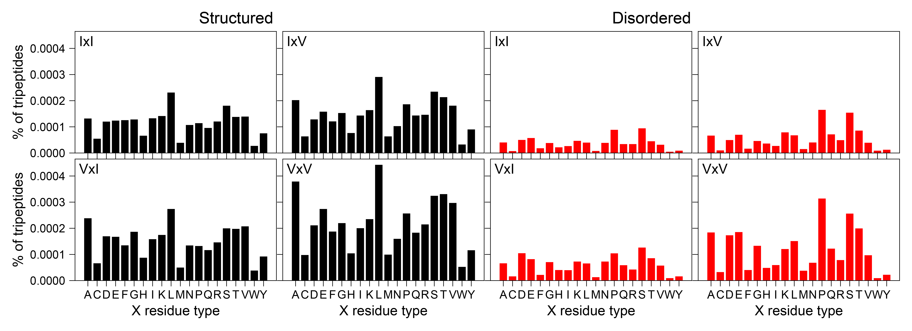

## Python code for the bioinformatics analyses from Alderson, Adriaenssens, et al.

### Searches an inputted proteome for specific motifs and perform statistical tests.  

To execute this script, the user must have **itertools**, **numpy**, and **pandas** installed in their Python distribution. The user must provide a proteome file downloaded from [UniProt](https://www.uniprot.org/) or in FASTA format: 

For an example output, see the image below:  

  

See these pages for installation of the various Python packages: 
[numpy](https://docs.scipy.org/doc/numpy-1.10.1/user/install.html)  
[numpy via a pre-built package](https://scipy.org/install.html)  
[matplotlib](https://matplotlib.org/faq/installing_faq.html) 
[pandas](https://pypi.org/project/pandas/) 

